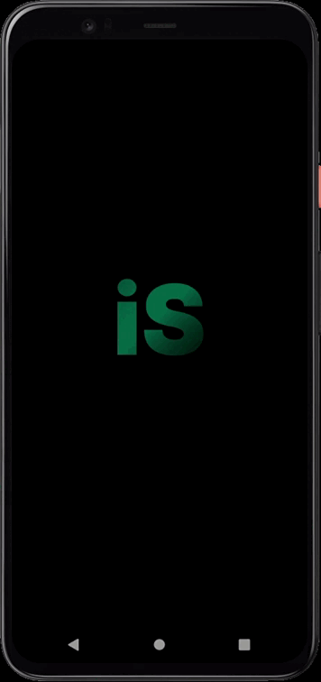

## 💻 Projeto

# Igniteshoesapp

[](https://github.com/linkdri1/igniteshoesapp/blob/main/LICENSE)

# Sobre o projeto

Aplicação para controle de Loja virtual para compra de produtos on line permitindo que o usuário filtre por marcas modelos tamanhos direcione para o carrinho.

 **</>Codelink**.

Aplicação utilizando framework react native na pratica.


## Layout mobile



Aplicação feita na trilha ignite da Rocketseat

# Tecnologias utilizadas
## Aplicação

- [Expo](https://docs.expo.dev/?utm_source=google&utm_medium=cpc&utm_content=search&gclid=CjwKCAjwxOymBhAFEiwAnodBLE4O6-g49a-HniPnrQt_l-6t_CNvui4z2_h31jUCUpesirHbFYmI_hoC39IQAvD_BwE)
- [Native basse](https://nativebase.io)
- [TypeScript](https://www.typescriptlang.org/docs/)
- [Google fonts](https://docs.expo.dev/develop/user-interface/fonts/#use-a-google-font)
- [react-native-dotenv](https://www.npmjs.com/package/react-native-dotenv)
- [Google cloud](https://console.cloud.google.com/welcome?hl=pt-br&project=ignitefleet-395716)
- [Expo AuthSession](https://docs.expo.dev/versions/latest/sdk/auth-session/?utm_source=google&utm_medium=cpc&utm_content=performancemax&gclid=CjwKCAjw29ymBhAKEiwAHJbJ8pY-Lk3ABjSLBFqMuV7A63VxK-6VDFHeUv57EdQlDdf435jvOsBg3xoC3_QQAvD_BwE)
- [Expo WebBrowser](https://docs.expo.dev/versions/latest/sdk/webbrowser/)
- [MongoDB Atlas](https://www.mongodb.com/atlas/database)
- [Realm DB](https://www.mongodb.com/docs/realm/sdk/react-native/install/)
- [NPM](https://docs.npmjs.com)


# Funcionalidades do projet

- [x] Tela Home
- [x] Funcionalidade fila 
- [x] Seleção de produtos 
- [x] Tela de carrinho 
- [x] funcionalidades de excluir e adicionar 


# Como executar o projeto

```bash
# clonar repositório
git clone https://github.com/linkdri1/Projeto_ImHere.git

# entrar na pasta do projeto.
cd Projeto Fleet

# instalar o pacote node_modules.
npm install

# gerar a build.
npx expo run:android

# Executar o projeto
npx expo run:android
```
## Aplicação Mobile
Pré-requisitos: npm 

# Autor

Rodrigo Teixeira Silva


## [Linkedin](https://www.linkedin.com/in/rodrigo-teixeira-silva/)

